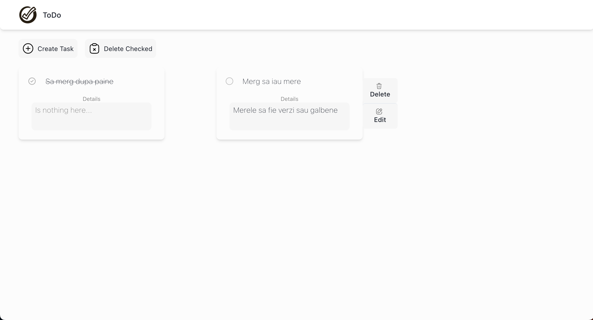
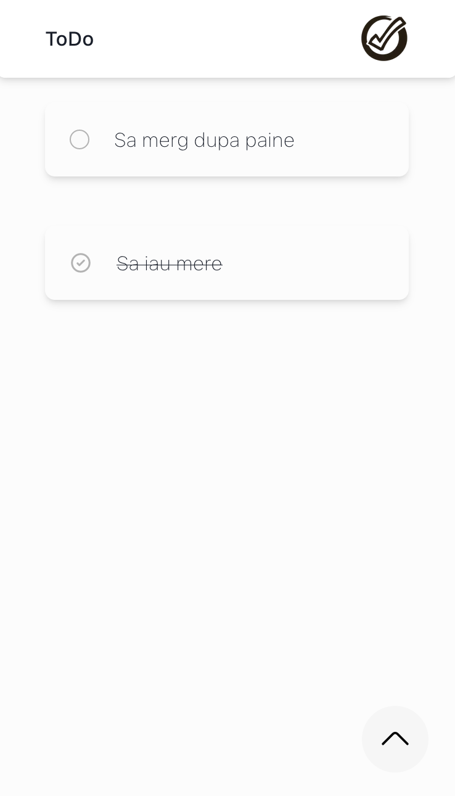
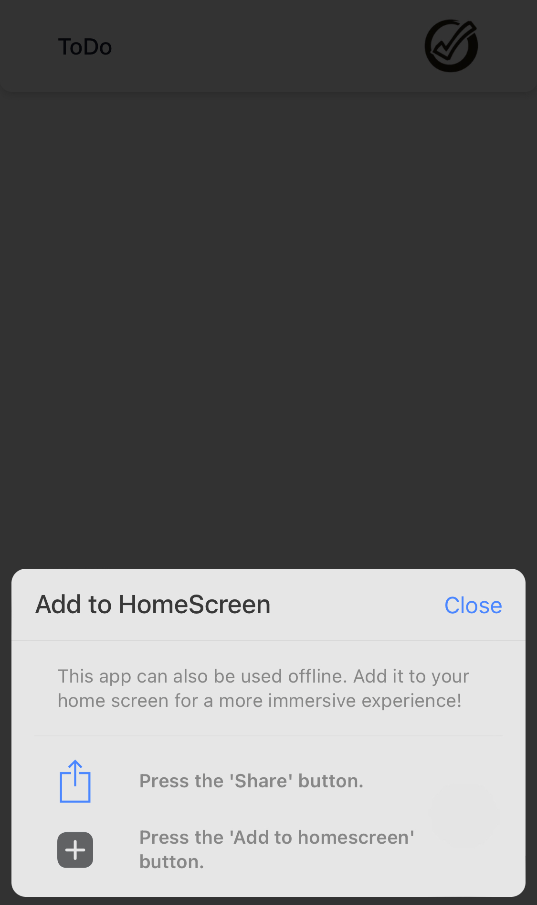
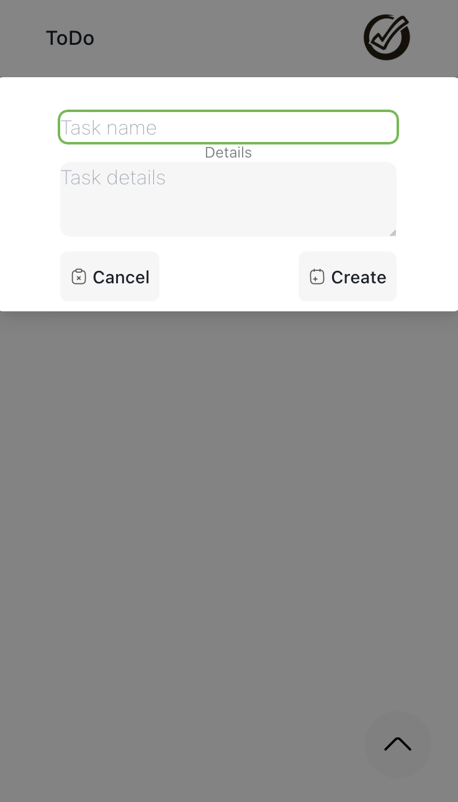
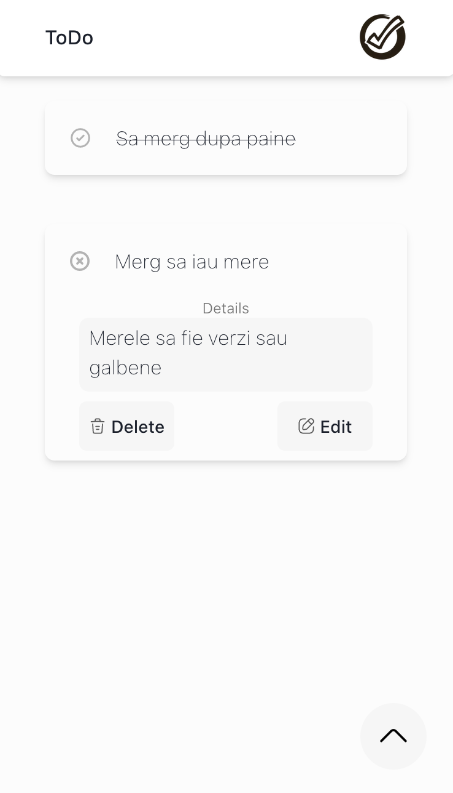
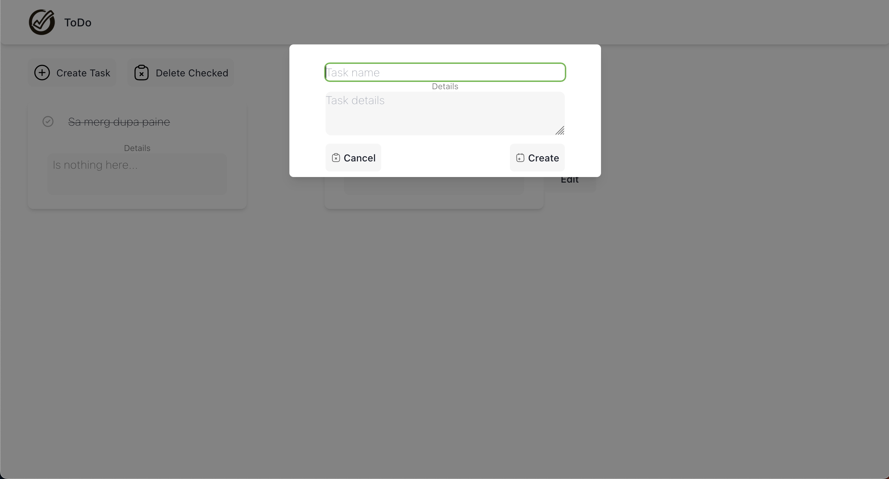

<div align="center">
  <a href="https://todo.rares-andrei.me">
    
  </a>
    <h3 align="center">ToDo</h3>
</div>

## About



A todo website that can be used offline as well as online, thanks to its Progressive Web App (PWA) capabilities. Add it to your home screen for a seamless experience, whether you have an internet connection or not.

### Technologies used

* NextJS
* Next-PWA
* Tailwindcss
* Chakra-ui
* HeadlessUI
* LocalStorage

## Install

1. Clone the project
```sh
git clone https://github.com/rsh1337/todo-app
```
2. Installing NPM Packages
```sh
npm install
```
3. Build the Project
```sh
npm run build
```
4. Start the Project
```sh
npm run start
```
5. Access it on
```
localhost:3003
```

## Screenshots Mobile









## Screenshots Desktop


